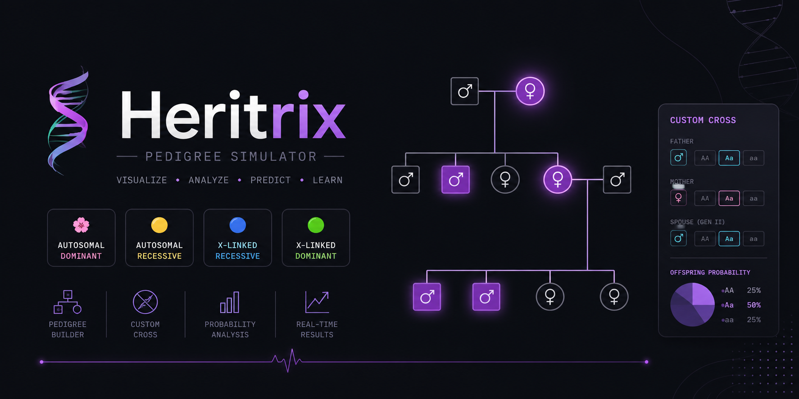

  

# 🧬 Heritrix

### Interactive Pedigree Simulator

Heritrix is an interactive pedigree analysis tool designed to visualize Mendelian inheritance through animated family trees, genetic crosses, and real-time probability calculations.

---

## ✨ Features

- Interactive pedigree visualization
- Four inheritance modes
- Custom cross builder
- Real-time genotype & phenotype prediction
- Animated pedigree generation
- Probability calculator
- Responsive design
- Browser-based — no installation required

---

## 🧬 Inheritance Modes

- Autosomal Dominant
- Autosomal Recessive
- X-Linked Dominant
- X-Linked Recessive

---

## 🎓 Built For

- Class XI & XII Biology
- Genetics
- Mendelian Inheritance
- Interactive Classroom Teaching
- NCERT-aligned learning

---

## 👨‍🔬 Author

**Draven Ashcroft**

*M.Sc. Agricultural Entomology*  
*ASRB–NET Qualified*  
*DIPS Chain of Institutions, Tanda*

---

## 🙏 Acknowledgements

Developed through a collaborative human–AI workflow.

- **Claude** — Core implementation & optimization
- **OpenAI** — Scientific review & debugging
- **Google Gemini** — Concept refinement

---

## 📄 License

GNU General Public License v3.0 (GPL-3.0).

---

# 🧬 Heritrix

### *Visualizing the Patterns of Inheritance.*

